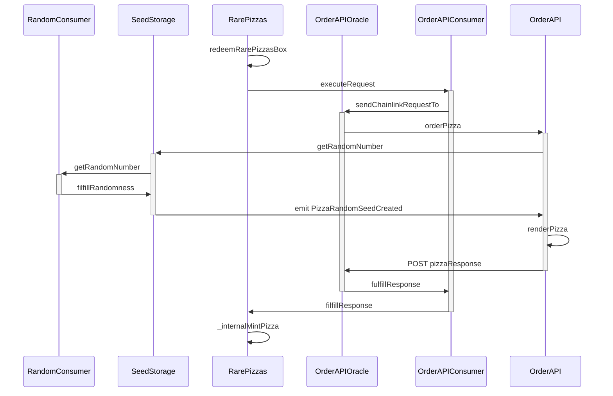

```mermaid

sequenceDiagram
    participant RandomConsumer
    participant SeedStorage
    participant RarePizzas
    participant OrderAPIOracle
    participant OrderAPIConsumer
    participant OrderAPI

    RarePizzas->>RarePizzas: redeemRarePizzasBox
    RarePizzas->>+OrderAPIConsumer: executeRequest
    OrderAPIConsumer->>+OrderAPIOracle: sendChainlinkRequestTo
    OrderAPIOracle->>+OrderAPI: orderPizza
    OrderAPI->>+SeedStorage: getRandomNumber
    SeedStorage->>+RandomConsumer: getRandomNumber
    RandomConsumer->>-SeedStorage: filfillRandomness
    SeedStorage->>-OrderAPI: emit PizzaRandomSeedCreated
    OrderAPI->>OrderAPI: renderPizza
    OrderAPI->>-OrderAPIOracle: POST pizzaResponse
    OrderAPIOracle->>-OrderAPIConsumer: fulfillResponse
    OrderAPIConsumer->>-RarePizzas: filfillResponse
    RarePizzas->>RarePizzas: _internalMintPizza
```
